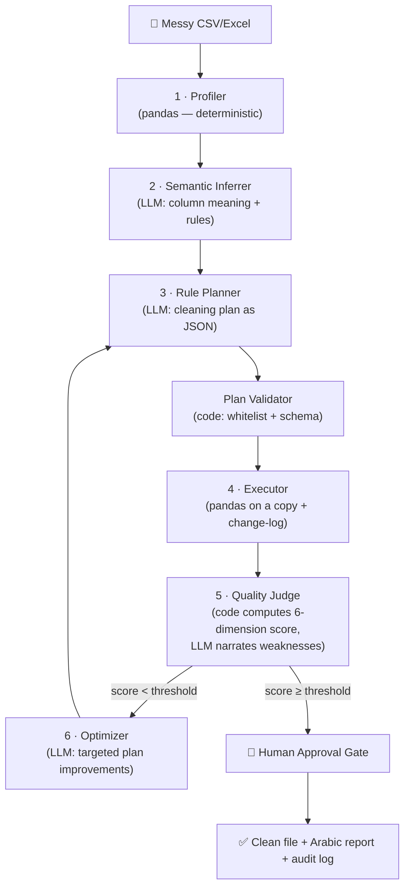

# 🧹 Data Quality Auto-Fixer

**An AI multi-agent system that automatically repairs messy datasets using an evaluator–optimizer loop — Arabic-first.**

> 🚧 **Status: In active development (Phase 1 of 5)** — scaffolding and core profiling. Roadmap below.

---

## The Problem

Data analysts spend **45–60% of their time** cleaning data instead of analyzing it — and 76% call it the worst part of their job (CrowdFlower 2016, Anaconda 2020). Poor data quality costs the average organization **$12.9M per year** (Gartner), and Gartner predicts **60% of AI projects through 2026 will be abandoned** due to data that isn't AI-ready.

Existing tools either **detect** problems (Great Expectations) or hand you **manual** transformation tools (OpenRefine, pandas). None of them *decides* the fix, *explains* it, and *verifies* the result — and almost none of them handle **Arabic data** (alef variants, Hindi/Arabic numerals, mixed-script text, inconsistent city names).

## The Solution

Upload a messy CSV → the system profiles it, proposes cleaning transformations, **scores the result numerically**, and iterates until quality passes a threshold — with **human approval required before any change is applied**.

The output is a number: **"Data quality raised from 62% → 94%"** — plus a clean file, an Arabic executive report, and a full audit log.

## Architecture — Evaluator–Optimizer Pattern

**Core principle: the LLM never touches the data.** It proposes a plan (JSON from a closed operation registry) and explains decisions. Deterministic pandas code is the only thing that transforms rows and computes scores — making every run reproducible and hallucination-free.



### Quality Score (computed, never generated)

Six standard dimensions, each measured in code and normalized to [0, 1], combined as a weighted sum:

| Dimension | Formula | Default weight |
|---|---|---|
| Completeness | 1 − (empty cells ÷ total) | 0.25 |
| Validity | 1 − (rule/format violations ÷ checked) | 0.25 |
| Uniqueness | 1 − (duplicate rows ÷ total) | 0.15 |
| Consistency | 1 − (contradictions ÷ checks) | 0.15 |
| Accuracy | 1 − (range/reference failures ÷ total) | 0.15 |
| Timeliness | 1 − (records older than SLA ÷ total) | 0.05 |

Non-applicable dimensions are dropped and weights renormalized. The loop stops on: threshold reached, diminishing returns (ΔDQ < 1%), iteration cap, or regression (best-so-far plan is always kept).

### Governance

- **Human-in-the-loop:** nothing is written without explicit approval; destructive ops approved individually
- **No data loss:** original file is immutable; all work happens on copies; every op is reversible
- **Append-only audit log:** every transformation recorded (op, params, rows affected, before/after) — the full recipe is replayable
- **Privacy by design:** the LLM sees only masked samples and aggregate profiles, never the full dataset

## Arabic-First 🇸🇦

Most data-quality tools break on Arabic. This system is built for it:

- Alef variants normalization (ا / أ / إ / آ)
- Hindi ↔ Arabic numeral unification (٠١٢٣ ↔ 0123)
- Mixed Arabic/English text handling
- City-name variant resolution (الرياض / الریاض / Riyadh)
- Auto-generated **Arabic executive quality report**

## Tech Stack

| Layer | Choice |
|---|---|
| UI | Streamlit |
| Agent loop | Python + LLM API (model-agnostic: Gemini / Claude) |
| Data engine | pandas (all transformations — deterministic) |
| Profiling | ydata-profiling + custom Arabic checks |
| Deployment | Streamlit Community Cloud |

## Roadmap

- [x] **Phase 0** — Repo, scaffolding, architecture design
- [x] **Phase 1** — MVP: upload → profile → LLM cleaning plan → human approval → apply → download (closed op-registry + plan validator live)
- [ ] **Phase 2** — Evaluator–optimizer loop with live quality score
- [ ] **Phase 3** — Human approval gate (per-operation review)
- [ ] **Phase 4** — Arabic executive report (PDF/HTML) + audit log export
- [ ] **Phase 5** — Polish: demo video, Saudi open-data demo, tests

## Run Locally

```bash
pip install -r requirements.txt
streamlit run app.py
```

Set your LLM API key in `.streamlit/secrets.toml` (never committed):

```toml
GEMINI_API_KEY = "your-key-here"
```

---

*Built with AI-assisted development — architecture, quality dimensions, guardrails and evaluation design by [Ranem Almutiri](https://www.linkedin.com/in/ran8/).*
