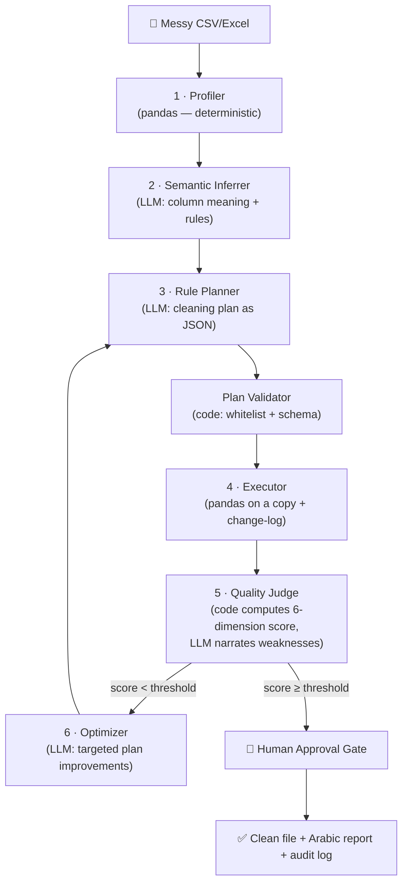

# 🧹 Data Quality Auto-Fixer

**An AI multi-agent system that automatically repairs messy datasets using an evaluator–optimizer loop — Arabic-first.**

### 🔴 Live demo: [data-quality-auto-fixer.streamlit.app](https://data-quality-auto-fixer.streamlit.app/)

Try it now — upload [`data/samples/messy_customers_ar.csv`](data/samples/messy_customers_ar.csv) and watch the system profile it, propose an AI cleaning plan, and wait for your approval before touching anything.

> ✅ **Phases 0–2 shipped** — the full evaluator–optimizer loop is live: watch the quality score climb iteration by iteration. Roadmap below.

---

## The Problem

Data analysts spend **45–60% of their time** cleaning data instead of analyzing it — and 76% call it the worst part of their job (CrowdFlower 2016, Anaconda 2020). Poor data quality costs the average organization **$12.9M per year** (Gartner), and Gartner predicts **60% of AI projects through 2026 will be abandoned** due to data that isn't AI-ready.

Existing tools either **detect** problems (Great Expectations) or hand you **manual** transformation tools (OpenRefine, pandas). None of them *decides* the fix, *explains* it, and *verifies* the result — and almost none of them handle **Arabic data** (alef variants, Hindi/Arabic numerals, mixed-script text, inconsistent city names).

## The Solution

Upload a messy CSV → the system profiles it, proposes cleaning transformations, **scores the result numerically**, and iterates until quality passes a threshold — with **human approval required before any change is applied**.

The output is a number — **measured, never generated**. On the demo dataset the system raises the overall quality score from **87 → 98**, with the validity dimension jumping from **67% → 98%** (phones normalized to +966 E.164, mixed dates to ISO, amounts to real numbers). Plus: a clean file and a full audit log of every change.

## Architecture — Evaluator–Optimizer Pattern

**Core principle: the LLM never touches the data.** It proposes a plan (JSON from a closed operation registry) and explains decisions. Deterministic pandas code is the only thing that transforms rows and computes scores — making every run reproducible and hallucination-free.



### Quality Score (computed, never generated)

Six standard dimensions, each measured in code and normalized to [0, 1], combined as a weighted sum:

| Dimension | Formula | Status |
|---|---|---|
| Completeness | 1 − (empty cells ÷ total) | ✅ live |
| Validity | share of values matching the column's detected target format (phone → +9665XXXXXXXX, date → ISO, numeric → real numbers) | ✅ live |
| Uniqueness | 1 − (duplicate rows ÷ total) | ✅ live |
| Consistency | share of text cells free of representation noise (alef variants, Hindi numerals, untrimmed whitespace) | ✅ live |
| Accuracy | reference/range checks | Phase 3+ |
| Timeliness | records within SLA | Phase 3+ |

Column kinds (phone / date / numeric / text) are detected deterministically from name hints + content shape — no LLM involved in scoring. Non-applicable dimensions are dropped and weights renormalized. The optimizer loop stops on: threshold reached, diminishing returns, iteration cap, or regression (best-so-far plan is always kept).

### Governance

- **Human-in-the-loop:** nothing is written without explicit approval; destructive ops approved individually
- **No data loss:** original file is immutable; all work happens on copies; every op is reversible
- **Append-only audit log:** every transformation recorded (op, params, rows affected, before/after) — the full recipe is replayable
- **Privacy by design:** the LLM sees only aggregate profiles and a 5-row sample, never the full dataset

## Arabic-First 🇸🇦

Most data-quality tools break on Arabic. This system is built for it:

- Alef variants normalization (ا / أ / إ / آ)
- Hindi ↔ Arabic numeral unification (٠١٢٣ ↔ 0123)
- Mixed Arabic/English text handling
- City-name variant resolution (الرياض / الریاض / Riyadh)
- Auto-generated **Arabic executive quality report**

## Tech Stack

| Layer | Choice |
|---|---|
| UI | Streamlit |
| Agent loop | Python + Gemini API (model-agnostic design — swappable endpoint) |
| Data engine | pandas (all transformations — deterministic, closed op registry) |
| Profiling | Custom Arabic-aware profiler (pandas, fully vectorized) |
| Tests | pytest — every reviewed bug is pinned by a test |
| Deployment | Streamlit Community Cloud |

## Roadmap

- [x] **Phase 0** — Repo, scaffolding, architecture design
- [x] **Phase 1** — MVP: upload (or one-click sample) → profile → LLM cleaning plan → per-op human approval → apply → download. Closed op-registry + plan validator + deterministic fallback plan + pytest suite live
- [x] **Phase 2a** — Validity & consistency dimensions with deterministic column-kind detection: cleaning now measurably raises the score (87 → 98 on the demo dataset)
- [x] **Phase 2b** — Full evaluator–optimizer loop, live: Planner proposes → Executor applies (on copies) → Judge measures and emits a targeted weakness vector → Optimizer improves the plan → repeat. Stops on threshold / diminishing returns / stagnation / iteration cap, always keeping the best-so-far plan. Live iteration log in the UI
- [ ] **Phase 3** — Per-op dry-run preview (see affected cells before approving)
- [ ] **Phase 4** — Arabic executive report (HTML/RTL) + audit log export
- [ ] **Phase 5** — Polish: demo video/GIF, Saudi open-data demo, CI badge

## Run Locally

```bash
pip install -r requirements.txt
streamlit run app.py
```

Set your LLM API key in `.streamlit/secrets.toml` (never committed):

```toml
GEMINI_API_KEY = "your-key-here"
```

---

*Built with AI-assisted development — architecture, quality dimensions, guardrails and evaluation design by [Ranem Almutiri](https://www.linkedin.com/in/ran8/).*
